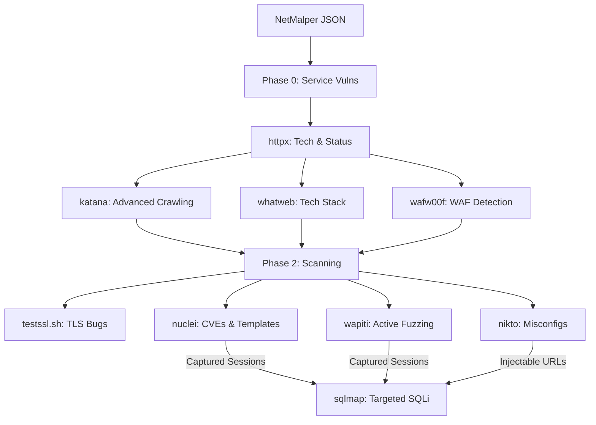

# 🛡️ VulnMalper

[](https://github.com/MKMithun2806/VulnMalper)
[](https://opensource.org/licenses/MIT)
[](https://www.python.org/downloads/)
[](https://www.docker.com/)

**The ultimate vulnerability pipeline that eats [NetMalper](https://github.com/MKMithun2806/NetMalper) graphs for breakfast.**

VulnMalper automates a multi-stage security auditing workflow: **Fingerprint → Scan → Verify**. Every stage intelligently feeds the next, ensuring maximum coverage with zero blind spraying.

---

## 🚀 The Pipeline

VulnMalper orchestrates a suite of industry-standard tools, handling dependencies automatically via Docker if they aren't found locally.



### 🧠 Smart Features

*   **Auto-Runner:** Use `--runner auto` (default) to run tools locally if present, falling back to official Docker images otherwise.
*   **Session Handover:** Automatically captures session cookies from successful `nuclei` or `wapiti` login findings and passes them to `sqlmap` for authenticated scanning.
*   **Stealth Profiles:** Randomized User-Agents and headers to avoid simple pattern-based detection.
*   **WAF Awareness:** Automatically detects WAFs and adjusts tool behavior (e.g., adding SQLMap tamper scripts).
*   **Zero Bloat:** Outputs a clean, actionable **Markdown report** and a high-signal console summary.

---

## 📦 Installation

### 1. Quick Install (Debian/Ubuntu)

```bash
URL=$(curl -s https://api.github.com/repos/MKMithun2806/VulnMalper/releases/latest | grep browser_download_url | grep .deb | cut -d '"' -f 4)
curl -L -o vulnmalper.deb "$URL"
sudo apt install -y ./vulnmalper.deb
rm vulnmalper.deb
```
*This installs the `vulnmalper` command, man pages, and bash completion.*

### 2. From Source

```bash
git clone https://github.com/MKMithun2806/VulnMalper
cd VulnMalper
# No python dependencies! Just standard library.
./vulnmalper.py --help
```

### 3. External Tool Dependencies

VulnMalper automatically pulls Docker images for missing tools. However, for local execution, you can install them manually:

```bash
sudo apt install nikto sqlmap whatweb wafw00f
pip install wapiti3
# Go-based tools
go install github.com/projectdiscovery/httpx/cmd/httpx@latest
go install github.com/projectdiscovery/nuclei/v3/cmd/nuclei@latest
go install github.com/projectdiscovery/katana/cmd/katana@latest
```

---

## 🛠️ Usage

```bash
# Basic run with a NetMalper graph
vulnmalper targets.json

# Authenticated scan with session handover
vulnmalper targets.json --auth-user admin --auth-pass password123

# Focused scan with high severity only
vulnmalper targets.json --only nuclei,sqlmap --severity high
```

### Key Flags

| Flag | Description |
| :--- | :--- |
| `--runner` | `auto` (default), `local`, or `docker`. |
| `--only` | Comma-separated list of tools to run. |
| `--threads` | Number of parallel target workers (default: 5). |
| `--severity` | Minimum nuclei severity to report (`info`, `low`, `medium`, `high`, `critical`). |
| `--out` | Custom name for the Markdown report. |

---

## 🏗️ Building from Source

To build your own `.deb` package:

```bash
./build_deb.sh 7.3.6
```
*Requires `dpkg-dev`.*

---

## 📄 License

MIT © [MKMithun](https://github.com/MKMithun2806)

*Pairs perfectly with [NetMalper](https://github.com/MKMithun2806/NetMalper). Crush some boxes.*
